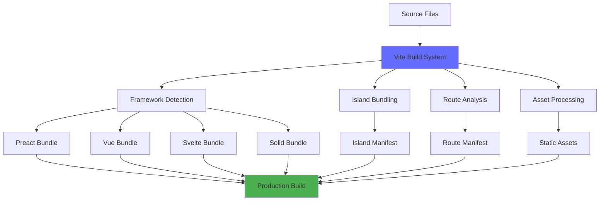
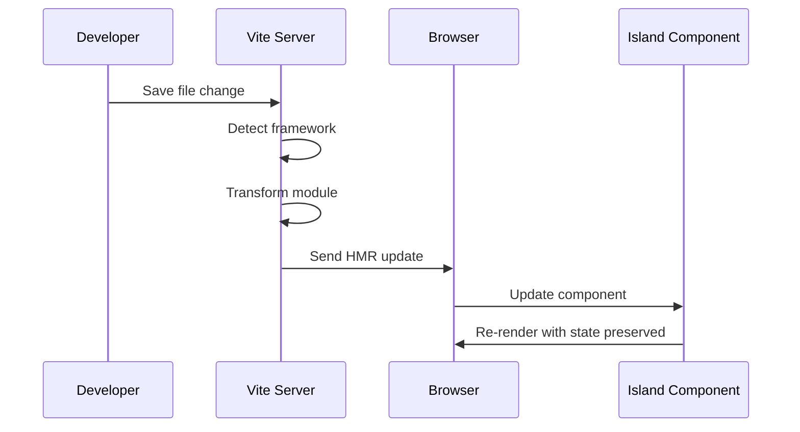
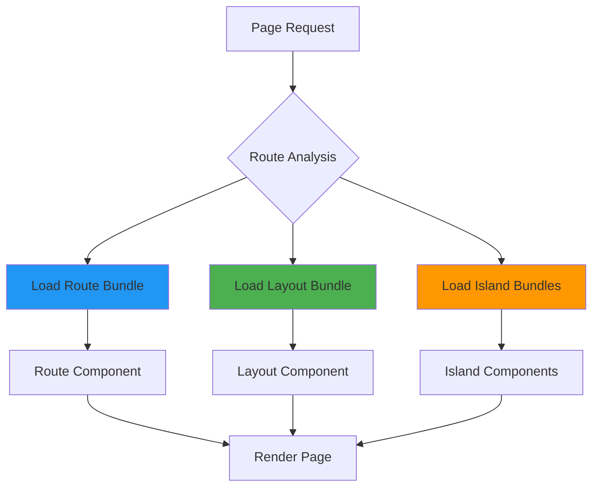
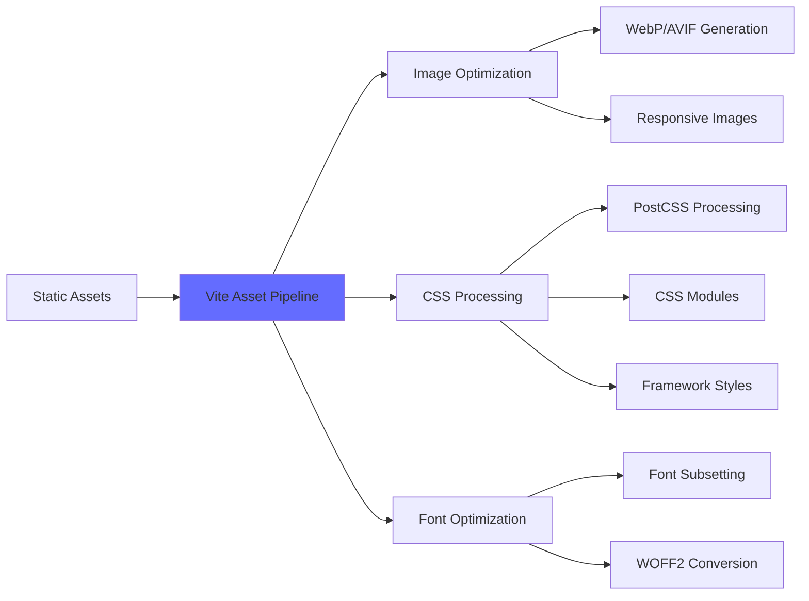
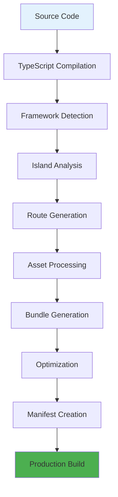

# Build System and Vite Integration

Avalon's build system is powered by Vite, providing lightning-fast development and optimized production builds. The integration handles islands bundling, multi-framework support, SSR/SSG optimization, and advanced features like code splitting and tree shaking.

## Architecture Overview



## Development Mode

### Hot Module Replacement (HMR)

Avalon provides instant feedback during development with framework-specific HMR:



### Framework-Specific HMR

```tsx
// Preact islands - state preserved during HMR
// src/islands/Counter.tsx
import { useState } from 'preact/hooks';

export default function Counter() {
  const [count, setCount] = useState(0);

  return (
    <div>
      <p>Count: {count}</p>
      <button onClick={() => setCount(count + 1)}>
        Increment
      </button>
    </div>
  );
}

// Vue islands - reactive state preserved
// src/islands/VueCounter.vue
<template>
  <div>
    <p>Count: {{ count }}</p>
    <button @click="increment">Increment</button>
  </div>
</template>

<script setup>
import { ref } from 'vue';

const count = ref(0);
const increment = () => count.value++;
</script>

// Svelte islands - component state preserved
// src/islands/SvelteCounter.svelte
<script>
  let count = 0;

  function increment() {
    count += 1;
  }
</script>

<div>
  <p>Count: {count}</p>
  <button on:click={increment}>Increment</button>
</div>
```

### Development Server Configuration

```typescript
// vite.config.ts
import { defineConfig } from 'vite';
import { avalon } from '@avalon/vite-plugin';

export default defineConfig({
	plugins: [
		avalon({
			// Framework detection and bundling
			frameworks: ['preact', 'vue', 'svelte', 'solid'],

			// Island configuration
			islands: {
				dir: 'src/islands',
				pattern: '**/*.{tsx,vue,svelte}',
				hydration: {
					strategy: 'auto', // auto-detect based on client: directives
					preload: ['critical'], // preload critical islands
				},
			},

			// SSR configuration
			ssr: {
				external: ['@prisma/client'], // externalize server-only deps
				noExternal: ['date-fns'], // bundle specific deps for SSR
			},

			// Development optimizations
			dev: {
				hmr: {
					overlay: true, // show error overlay
					clientPort: 3001, // custom HMR port
				},
				sourcemap: true,
				optimizeDeps: {
					include: ['preact/hooks', 'vue', 'svelte/store'],
				},
			},
		}),
	],

	// Vite-specific configuration
	server: {
		port: 3000,
		host: true, // expose to network
		cors: true,
	},

	// Build optimizations
	build: {
		target: 'es2020',
		sourcemap: true,
		rollupOptions: {
			output: {
				manualChunks: {
					// Separate vendor chunks
					'vendor-preact': ['preact', 'preact/hooks'],
					'vendor-vue': ['vue'],
					'vendor-svelte': ['svelte'],
					'vendor-solid': ['solid-js'],
				},
			},
		},
	},
});
```

## Island Bundling Strategy

### Automatic Island Detection

Avalon automatically detects and bundles islands based on file patterns and framework imports:

```typescript
// Build-time island detection
const islandDetection = {
	// File-based detection
	patterns: [
		'src/islands/**/*.tsx', // Preact/Solid islands
		'src/islands/**/*.vue', // Vue islands
		'src/islands/**/*.svelte', // Svelte islands
	],

	// Import-based detection
	frameworks: {
		preact: ['preact', 'preact/hooks', 'preact/compat'],
		vue: ['vue', '@vue/reactivity'],
		svelte: ['svelte', 'svelte/store'],
		solid: ['solid-js', 'solid-js/store'],
	},

	// Client directive detection
	hydration: ['client:load', 'client:idle', 'client:visible', 'client:media', 'client:only'],
};
```

### Island Manifest Generation

```typescript
// Generated island manifest (build output)
// dist/island-manifest.json
{
  "islands": {
    "Counter": {
      "framework": "preact",
      "chunk": "islands/Counter-abc123.js",
      "css": "islands/Counter-def456.css",
      "dependencies": ["preact", "preact/hooks"],
      "size": 2847,
      "hydration": ["client:load", "client:idle"]
    },
    "VueForm": {
      "framework": "vue",
      "chunk": "islands/VueForm-ghi789.js",
      "css": "islands/VueForm-jkl012.css",
      "dependencies": ["vue"],
      "size": 4521,
      "hydration": ["client:load"]
    },
    "SvelteChart": {
      "framework": "svelte",
      "chunk": "islands/SvelteChart-mno345.js",
      "css": "islands/SvelteChart-pqr678.css",
      "dependencies": ["svelte", "d3"],
      "size": 8934,
      "hydration": ["client:visible"]
    }
  },
  "frameworks": {
    "preact": {
      "runtime": "frameworks/preact-runtime-stu901.js",
      "size": 3024
    },
    "vue": {
      "runtime": "frameworks/vue-runtime-vwx234.js",
      "size": 10240
    },
    "svelte": {
      "runtime": "frameworks/svelte-runtime-yza567.js",
      "size": 1856
    }
  }
}
```

## Code Splitting and Lazy Loading

### Route-Based Code Splitting



### Dynamic Island Loading

```tsx
// Client-side island loading
class IslandLoader {
	private loadedFrameworks = new Set<string>();
	private loadedIslands = new Map<string, any>();

	async loadIsland(name: string, framework: string, hydration: string) {
		// Load framework runtime if not already loaded
		if (!this.loadedFrameworks.has(framework)) {
			await this.loadFramework(framework);
			this.loadedFrameworks.add(framework);
		}

		// Load island component
		if (!this.loadedIslands.has(name)) {
			const island = await this.loadIslandComponent(name);
			this.loadedIslands.set(name, island);
		}

		// Hydrate based on strategy
		return this.hydrateIsland(name, hydration);
	}

	private async loadFramework(framework: string) {
		const manifest = await fetch('/island-manifest.json').then(r => r.json());
		const frameworkInfo = manifest.frameworks[framework];

		if (frameworkInfo) {
			await import(frameworkInfo.runtime);
		}
	}

	private async loadIslandComponent(name: string) {
		const manifest = await fetch('/island-manifest.json').then(r => r.json());
		const islandInfo = manifest.islands[name];

		if (islandInfo) {
			return await import(islandInfo.chunk);
		}
	}

	private hydrateIsland(name: string, strategy: string) {
		switch (strategy) {
			case 'client:load':
				return this.hydrateImmediately(name);
			case 'client:idle':
				return this.hydrateWhenIdle(name);
			case 'client:visible':
				return this.hydrateWhenVisible(name);
			default:
				return Promise.resolve();
		}
	}
}
```

## Build Optimization

### Tree Shaking

Avalon's build system eliminates unused code across frameworks:

```typescript
// Before tree shaking
import { useState, useEffect, useCallback, useMemo } from 'preact/hooks';
import { format, parse, isValid, addDays } from 'date-fns';

export default function DatePicker() {
	const [date, setDate] = useState(new Date());

	return (
		<div>
			<input type="date" value={format(date, 'yyyy-MM-dd')} onChange={e => setDate(new Date(e.target.value))} />
		</div>
	);
}

// After tree shaking (only used imports bundled)
// Final bundle includes:
// - useState from preact/hooks
// - format from date-fns
// Excluded: useEffect, useCallback, useMemo, parse, isValid, addDays
```

### Bundle Analysis

```bash
# Generate bundle analysis
deno task build --analyze

# Output: bundle-analysis.html
# Shows:
# - Bundle sizes by framework
# - Island dependencies
# - Shared chunks
# - Unused code detection
```

### Chunk Optimization

```typescript
// vite.config.ts - Advanced chunking strategy
export default defineConfig({
	build: {
		rollupOptions: {
			output: {
				manualChunks(id) {
					// Framework chunks
					if (id.includes('preact')) return 'framework-preact';
					if (id.includes('vue')) return 'framework-vue';
					if (id.includes('svelte')) return 'framework-svelte';
					if (id.includes('solid')) return 'framework-solid';

					// Vendor chunks
					if (id.includes('node_modules')) {
						// Large libraries get their own chunks
						if (id.includes('d3')) return 'vendor-d3';
						if (id.includes('three')) return 'vendor-three';
						if (id.includes('chart.js')) return 'vendor-charts';

						// Small utilities bundled together
						return 'vendor-utils';
					}

					// Island chunks by directory
					if (id.includes('src/islands/')) {
						const islandName = id.split('/').pop()?.split('.')[0];
						return `island-${islandName}`;
					}
				},
			},
		},
	},
});
```

## Asset Processing

### Static Asset Handling



### Image Optimization

```tsx
// Automatic image optimization
// src/components/OptimizedImage.tsx
interface ImageProps {
	src: string;
	alt: string;
	width?: number;
	height?: number;
	loading?: 'lazy' | 'eager';
}

export default function OptimizedImage({ src, alt, width, height, loading = 'lazy' }: ImageProps) {
	// Vite automatically generates optimized versions
	const webpSrc = src.replace(/\.(jpg|jpeg|png)$/, '.webp');
	const avifSrc = src.replace(/\.(jpg|jpeg|png)$/, '.avif');

	return (
		<picture>
			<source srcSet={avifSrc} type="image/avif" />
			<source srcSet={webpSrc} type="image/webp" />
			
		</picture>
	);
}

// Usage in islands
// src/islands/Gallery.tsx
import OptimizedImage from '../components/OptimizedImage.tsx';

export default function Gallery() {
	return (
		<div className="gallery">
			<OptimizedImage src="/images/hero.jpg" alt="Hero image" width={800} height={400} />
		</div>
	);
}
```

### CSS Processing

```scss
// Framework-specific CSS handling
// src/islands/StyledComponent.vue
<template>
  <div class="component">
    <h2 class="title">Vue Component</h2>
    <p class="content">Styled with scoped CSS</p>
  </div>
</template>

<style scoped>
.component {
  padding: 1rem;
  border: 1px solid #ccc;
  border-radius: 8px;
}

.title {
  color: #4fc08d;
  margin-bottom: 0.5rem;
}

.content {
  color: #666;
}
</style>
```

```svelte
<!-- src/islands/SvelteStyled.svelte -->
<div class="component">
  <h2 class="title">Svelte Component</h2>
  <p class="content">Styled with component CSS</p>
</div>

<style>
  .component {
    padding: 1rem;
    border: 1px solid #ccc;
    border-radius: 8px;
  }

  .title {
    color: #ff3e00;
    margin-bottom: 0.5rem;
  }

  .content {
    color: #666;
  }
</style>
```

## Production Build Process

### Build Pipeline



### Build Command Options

```bash
# Basic production build
deno task build

# Build with analysis
deno task build --analyze

# Build with specific target
deno task build --target=es2020

# Build with custom output directory
deno task build --outDir=dist-custom

# Build for specific deployment platform
deno task build --platform=vercel
deno task build --platform=netlify
deno task build --platform=deno-deploy
```

### Build Output Structure

```
dist/
├── client/                    # Client-side assets
│   ├── assets/
│   │   ├── index-abc123.js   # Main application bundle
│   │   ├── vendor-def456.js  # Vendor dependencies
│   │   └── style-ghi789.css  # Global styles
│   ├── islands/              # Island bundles
│   │   ├── Counter-jkl012.js
│   │   ├── VueForm-mno345.js
│   │   └── SvelteChart-pqr678.js
│   └── frameworks/           # Framework runtimes
│       ├── preact-stu901.js
│       ├── vue-vwx234.js
│       └── svelte-yza567.js
├── server/                   # Server-side code
│   ├── entry-server.js      # SSR entry point
│   ├── routes/              # Route handlers
│   └── api/                 # API handlers
├── static/                  # Static assets
│   ├── images/
│   ├── fonts/
│   └── favicon.ico
├── island-manifest.json     # Island metadata
├── route-manifest.json      # Route metadata
└── index.html              # HTML template
```

## Performance Monitoring

### Build Performance Metrics

```typescript
// Build performance tracking
interface BuildMetrics {
	totalTime: number;
	phases: {
		compilation: number;
		bundling: number;
		optimization: number;
		assetProcessing: number;
	};
	bundles: {
		name: string;
		size: number;
		gzipSize: number;
		modules: number;
	}[];
	islands: {
		name: string;
		framework: string;
		size: number;
		dependencies: string[];
	}[];
}

// Generated during build
const buildMetrics: BuildMetrics = {
	totalTime: 12.4,
	phases: {
		compilation: 3.2,
		bundling: 4.1,
		optimization: 3.8,
		assetProcessing: 1.3,
	},
	bundles: [
		{
			name: 'index',
			size: 45120,
			gzipSize: 12340,
			modules: 23,
		},
		{
			name: 'vendor-preact',
			size: 8960,
			gzipSize: 3210,
			modules: 5,
		},
	],
	islands: [
		{
			name: 'Counter',
			framework: 'preact',
			size: 2847,
			dependencies: ['preact', 'preact/hooks'],
		},
	],
};
```

### Runtime Performance

```typescript
// Client-side performance monitoring
class PerformanceMonitor {
	trackIslandHydration(islandName: string, framework: string) {
		const startTime = performance.now();

		return {
			end: () => {
				const endTime = performance.now();
				const duration = endTime - startTime;

				// Send to analytics
				this.sendMetric('island_hydration', {
					island: islandName,
					framework,
					duration,
					timestamp: Date.now(),
				});
			},
		};
	}

	trackBundleLoad(bundleName: string, size: number) {
		const startTime = performance.now();

		return {
			end: () => {
				const endTime = performance.now();
				const loadTime = endTime - startTime;

				this.sendMetric('bundle_load', {
					bundle: bundleName,
					size,
					loadTime,
					timestamp: Date.now(),
				});
			},
		};
	}

	private sendMetric(event: string, data: any) {
		// Send to your analytics service
		fetch('/api/analytics', {
			method: 'POST',
			headers: { 'Content-Type': 'application/json' },
			body: JSON.stringify({ event, data }),
		});
	}
}
```

## Advanced Configuration

### Custom Vite Plugins

```typescript
// Custom plugin for Avalon-specific optimizations
function avalonOptimizer(): Plugin {
	return {
		name: 'avalon-optimizer',

		// Transform island imports
		transform(code, id) {
			if (id.includes('src/islands/')) {
				// Add hydration metadata
				return {
					code: `${code}\n\n// Hydration metadata\nexport const __hydration = ${JSON.stringify({
						framework: detectFramework(code),
						dependencies: extractDependencies(code),
					})};`,
					map: null,
				};
			}
		},

		// Generate island manifest
		generateBundle(options, bundle) {
			const islandManifest = generateIslandManifest(bundle);

			this.emitFile({
				type: 'asset',
				fileName: 'island-manifest.json',
				source: JSON.stringify(islandManifest, null, 2),
			});
		},
	};
}

// Usage in vite.config.ts
export default defineConfig({
	plugins: [
		avalon(),
		avalonOptimizer(),
		// Other plugins...
	],
});
```

### Environment-Specific Builds

```typescript
// vite.config.ts
export default defineConfig(({ mode }) => {
	const isDev = mode === 'development';
	const isProd = mode === 'production';
	const isPreview = mode === 'preview';

	return {
		plugins: [
			avalon({
				dev: {
					hmr: isDev,
					sourcemap: isDev,
					minify: false,
				},
				build: {
					minify: isProd,
					sourcemap: isProd ? 'hidden' : true,
					target: isProd ? 'es2020' : 'esnext',
				},
			}),
		],

		define: {
			__DEV__: isDev,
			__PROD__: isProd,
			__PREVIEW__: isPreview,
		},

		build: {
			minify: isProd ? 'terser' : false,
			terserOptions: isProd
				? {
						compress: {
							drop_console: true,
							drop_debugger: true,
						},
				  }
				: undefined,
		},
	};
});
```

## Troubleshooting

### Common Build Issues

**Framework Detection Failures**

```bash
Error: Could not detect framework for island: MyComponent.tsx

Solutions:
1. Check import statements
2. Verify file extension (.tsx for Preact/Solid, .vue for Vue, .svelte for Svelte)
3. Add explicit framework annotation
```

**Bundle Size Issues**

```bash
Warning: Bundle size exceeds recommended limit (500KB)

Solutions:
1. Use dynamic imports for large dependencies
2. Enable tree shaking
3. Split large islands into smaller components
4. Use external CDN for heavy libraries
```

**Hydration Mismatches**

```bash
Error: Hydration mismatch in island: Counter

Solutions:
1. Ensure server and client render the same content
2. Use useEffect for client-only code
3. Check for date/time dependencies
4. Verify random number generation
```

## Best Practices

### 1. Optimize Bundle Sizes

```typescript
// ✅ Good - lazy load heavy dependencies
const ChartComponent = lazy(() => import('./HeavyChart.tsx'));

export default function Dashboard() {
	return (
		<div>
			<h1>Dashboard</h1>
			<Suspense fallback={<div>Loading chart...</div>}>
				<ChartComponent client:visible />
			</Suspense>
		</div>
	);
}

// ❌ Avoid - importing heavy libraries in main bundle
import { Chart } from 'chart.js'; // 200KB library
```

### 2. Use Appropriate Hydration Strategies

```tsx
// ✅ Good - match hydration to usage
<CriticalForm client:load />        // Immediate interaction needed
<SearchWidget client:idle />        // Important but not critical
<ImageGallery client:visible />     // Below the fold
<MobileMenu client:media="(max-width: 768px)" /> // Conditional
```

### 3. Leverage Build-Time Optimizations

```typescript
// ✅ Good - build-time data fetching
export async function getStaticProps() {
	const data = await fetchDataAtBuildTime();

	return {
		props: { data },
		revalidate: 3600,
	};
}

// ❌ Avoid - runtime data fetching for static content
export default function Page() {
	const [data, setData] = useState(null);

	useEffect(() => {
		fetchData().then(setData); // Should be done at build time
	}, []);
}
```

## Next Steps

- [Islands Architecture](./islands-architecture.md) - Understanding how islands are built and bundled
- [Multi-Framework Support](./multi-framework-support.md) - How different frameworks are handled in the build
- [Server-Side Rendering](./server-side-rendering.md) - How SSR/SSG affects the build process

## Examples

- [Custom Vite Plugin](../../examples/build/custom-plugin/)
- [Bundle Optimization](../../examples/build/optimization/)
- [Multi-Environment Setup](../../examples/build/environments/)
