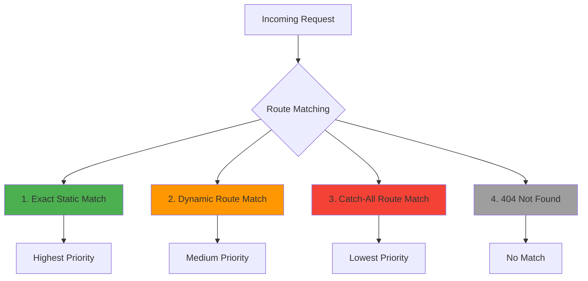
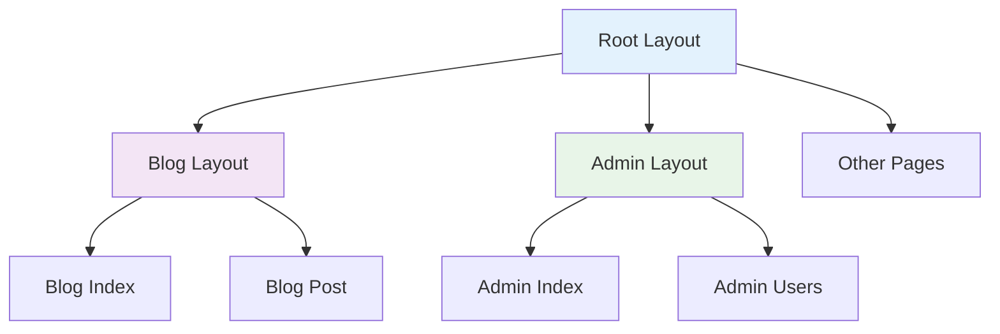
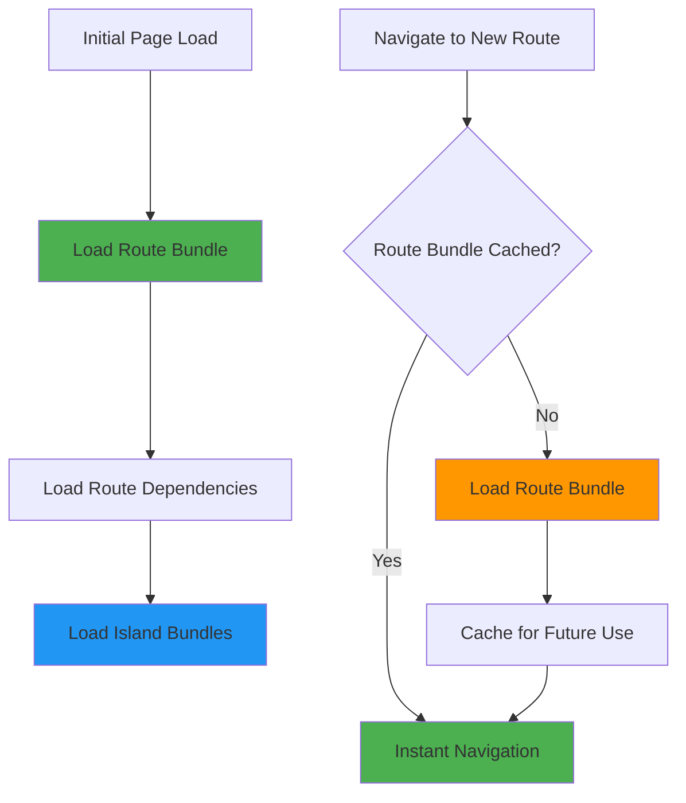

# File-System Routing

Avalon uses file-system based routing, where the structure of your files determines the URLs of your application. This approach is intuitive, scalable, and eliminates the need for complex routing configuration.

## How It Works

Your file structure directly maps to your application's URLs:

```mermaid
graph LR
    subgraph "File System"
        A[src/pages/]
        A --> B[index.tsx]
        A --> C[about.tsx]
        A --> D[blog/]
        D --> E[index.tsx]
        D --> F[post.tsx]
        D --> G[category/]
        G --> H[index.tsx]
    end

    subgraph "URLs"
        I[/]
        J[/about]
        K[/blog]
        L[/blog/post]
        M[/blog/category]
    end

    B --> I
    C --> J
    E --> K
    F --> L
    H --> M

    style A fill:#e3f2fd
    style D fill:#e3f2fd
    style G fill:#e3f2fd
```

## Basic Routing

### Static Routes

Static routes are created by adding files to the `src/pages/` directory:

```
src/pages/
├── index.tsx          → /
├── about.tsx          → /about
├── contact.tsx        → /contact
├── pricing.tsx        → /pricing
└── terms.tsx          → /terms
```

**Example page:**

```tsx
// src/pages/about.tsx
export default function About() {
	return (
		<div>
			<h1>About Us</h1>
			<p>Learn more about our company and mission.</p>
		</div>
	);
}
```

### Nested Routes

Create nested routes using folders:

```
src/pages/
├── index.tsx          → /
├── blog/
│   ├── index.tsx      → /blog
│   ├── getting-started.tsx → /blog/getting-started
│   └── advanced-tips.tsx   → /blog/advanced-tips
├── docs/
│   ├── index.tsx      → /docs
│   ├── installation.tsx → /docs/installation
│   └── api/
│       ├── index.tsx  → /docs/api
│       └── reference.tsx → /docs/api/reference
└── products/
    ├── index.tsx      → /products
    ├── web-hosting.tsx → /products/web-hosting
    └── domains.tsx    → /products/domains
```

## Dynamic Routes

Dynamic routes use square brackets `[]` to capture URL parameters:

### Single Parameter

```
src/pages/
├── blog/
│   ├── index.tsx      → /blog
│   └── [slug].tsx     → /blog/:slug
└── users/
    ├── index.tsx      → /users
    └── [id].tsx       → /users/:id
```

**Dynamic route example:**

```tsx
// src/pages/blog/[slug].tsx
import { useParams } from '../../../core/routing/hooks.ts';

export default function BlogPost() {
	const { slug } = useParams();

	return (
		<div>
			<h1>Blog Post: {slug}</h1>
			<p>This post has the slug: {slug}</p>
		</div>
	);
}

// Matches:
// /blog/getting-started → slug = "getting-started"
// /blog/advanced-tips   → slug = "advanced-tips"
// /blog/hello-world     → slug = "hello-world"
```

### Multiple Parameters

```
src/pages/
└── blog/
    ├── [category]/
    │   ├── index.tsx     → /blog/:category
    │   └── [slug].tsx    → /blog/:category/:slug
    └── [year]/
        └── [month]/
            └── [day]/
                └── [slug].tsx → /blog/:year/:month/:day/:slug
```

**Multiple parameters example:**

```tsx
// src/pages/blog/[category]/[slug].tsx
import { useParams } from '../../../../core/routing/hooks.ts';

export default function CategoryPost() {
	const { category, slug } = useParams();

	return (
		<div>
			<nav>
				<a href="/blog">Blog</a> →<a href={`/blog/${category}`}>{category}</a> →<span>{slug}</span>
			</nav>
			<h1>{slug.replace('-', ' ')}</h1>
			<p>Category: {category}</p>
		</div>
	);
}

// Matches:
// /blog/tutorials/getting-started → category="tutorials", slug="getting-started"
// /blog/news/product-launch      → category="news", slug="product-launch"
```

### Catch-All Routes

Use `[...param]` to catch multiple path segments:

```
src/pages/
└── docs/
    ├── index.tsx        → /docs
    └── [...path].tsx    → /docs/* (catches all sub-paths)
```

```tsx
// src/pages/docs/[...path].tsx
import { useParams } from '../../../core/routing/hooks.ts';

export default function DocsPage() {
	const { path } = useParams();
	const segments = Array.isArray(path) ? path : [path];

	return (
		<div>
			<nav>
				<a href="/docs">Docs</a>
				{segments.map((segment, index) => (
					<span key={index}>
						{' → '}
						<a href={`/docs/${segments.slice(0, index + 1).join('/')}`}>{segment}</a>
					</span>
				))}
			</nav>
			<h1>Documentation: {segments.join(' / ')}</h1>
		</div>
	);
}

// Matches:
// /docs/api/users/create → path = ["api", "users", "create"]
// /docs/guides/deployment → path = ["guides", "deployment"]
// /docs/any/deep/path    → path = ["any", "deep", "path"]
```

## Route Priority

When multiple routes could match a URL, Avalon follows this priority order:



**Example priority resolution:**

```
src/pages/
├── blog/
│   ├── index.tsx         → /blog (Priority 1)
│   ├── featured.tsx      → /blog/featured (Priority 1)
│   ├── [slug].tsx        → /blog/:slug (Priority 2)
│   └── [...path].tsx     → /blog/* (Priority 3)
```

For URL `/blog/featured`:

1. ✅ Matches `featured.tsx` (exact static match)
2. ❌ Would also match `[slug].tsx` but lower priority
3. ❌ Would also match `[...path].tsx` but lowest priority

## Layouts and Nested Routing

### Layout Files

Use `_layout.tsx` files to create layouts that wrap child routes:

```
src/pages/
├── _layout.tsx           → Root layout (wraps all pages)
├── index.tsx
├── blog/
│   ├── _layout.tsx       → Blog layout (wraps blog pages)
│   ├── index.tsx
│   └── [slug].tsx
└── admin/
    ├── _layout.tsx       → Admin layout (wraps admin pages)
    ├── index.tsx
    └── users.tsx
```

**Layout hierarchy visualization:**



**Root layout example:**

```tsx
// src/pages/_layout.tsx
import { ReactNode } from 'preact/compat';

interface LayoutProps {
	children: ReactNode;
}

export default function RootLayout({ children }: LayoutProps) {
	return (
		<html lang="en">
			<head>
				<meta charset="UTF-8" />
				<meta name="viewport" content="width=device-width, initial-scale=1.0" />
				<title>My Avalon App</title>
			</head>
			<body>
				<header>
					<nav>
						<a href="/">Home</a>
						<a href="/blog">Blog</a>
						<a href="/about">About</a>
					</nav>
				</header>

				<main>{children}</main>

				<footer>
					<p>&copy; 2024 My Avalon App</p>
				</footer>
			</body>
		</html>
	);
}
```

**Nested layout example:**

```tsx
// src/pages/blog/_layout.tsx
import { ReactNode } from 'preact/compat';

interface BlogLayoutProps {
	children: ReactNode;
}

export default function BlogLayout({ children }: BlogLayoutProps) {
	return (
		<div className="blog-container">
			<aside className="blog-sidebar">
				<h3>Recent Posts</h3>
				<ul>
					<li>
						<a href="/blog/getting-started">Getting Started</a>
					</li>
					<li>
						<a href="/blog/advanced-tips">Advanced Tips</a>
					</li>
					<li>
						<a href="/blog/best-practices">Best Practices</a>
					</li>
				</ul>

				<h3>Categories</h3>
				<ul>
					<li>
						<a href="/blog/tutorials">Tutorials</a>
					</li>
					<li>
						<a href="/blog/news">News</a>
					</li>
					<li>
						<a href="/blog/guides">Guides</a>
					</li>
				</ul>
			</aside>

			<div className="blog-content">{children}</div>
		</div>
	);
}
```

## Route Parameters and Query Strings

### Accessing Route Parameters

```tsx
// src/pages/users/[id]/profile.tsx
import { useParams, useSearchParams } from '../../../../core/routing/hooks.ts';

export default function UserProfile() {
	const { id } = useParams();
	const searchParams = useSearchParams();

	const tab = searchParams.get('tab') || 'overview';
	const edit = searchParams.has('edit');

	return (
		<div>
			<h1>User Profile: {id}</h1>
			<p>Current tab: {tab}</p>
			{edit && <p>Edit mode enabled</p>}

			<nav>
				<a href={`/users/${id}/profile?tab=overview`}>Overview</a>
				<a href={`/users/${id}/profile?tab=settings`}>Settings</a>
				<a href={`/users/${id}/profile?tab=activity`}>Activity</a>
			</nav>
		</div>
	);
}

// URL: /users/123/profile?tab=settings&edit=true
// id = "123"
// tab = "settings"
// edit = true
```

### Type-Safe Route Parameters

Define parameter types for better development experience:

```tsx
// src/types/routes.ts
export interface BlogPostParams {
	slug: string;
}

export interface UserParams {
	id: string;
}

export interface CategoryPostParams {
	category: string;
	slug: string;
}

// src/pages/blog/[slug].tsx
import { useParams } from '../../../core/routing/hooks.ts';
import type { BlogPostParams } from '../../types/routes.ts';

export default function BlogPost() {
	const { slug } = useParams<BlogPostParams>();

	// slug is now typed as string
	return (
		<div>
			<h1>{slug.replace('-', ' ')}</h1>
		</div>
	);
}
```

## API Routes

API routes follow the same file-system conventions but are placed in `src/api/`:

```
src/api/
├── hello.ts              → GET /api/hello
├── users/
│   ├── index.ts          → GET /api/users
│   ├── [id].ts           → GET /api/users/:id
│   └── [id]/
│       └── posts.ts      → GET /api/users/:id/posts
└── auth/
    ├── login.ts          → POST /api/auth/login
    └── logout.ts         → POST /api/auth/logout
```

**API route example:**

```tsx
// src/api/users/[id].ts
import { Request, Response } from '../../../types/api.ts';

export async function GET(req: Request, res: Response) {
	const { id } = req.params;

	// Fetch user data
	const user = await getUserById(id);

	if (!user) {
		return res.status(404).json({ error: 'User not found' });
	}

	return res.json(user);
}

export async function PUT(req: Request, res: Response) {
	const { id } = req.params;
	const updates = await req.json();

	const updatedUser = await updateUser(id, updates);

	return res.json(updatedUser);
}

export async function DELETE(req: Request, res: Response) {
	const { id } = req.params;

	await deleteUser(id);

	return res.status(204).send();
}
```

## Route Metadata

Add metadata to routes for SEO and social sharing:

```tsx
// src/pages/blog/[slug].tsx
import { RouteMetadata } from '../../../types/routing.ts';

export const metadata: RouteMetadata = {
	title: 'Blog Post',
	description: 'Read our latest blog post',
	openGraph: {
		type: 'article',
		siteName: 'My Blog',
	},
};

// Dynamic metadata based on route parameters
export async function generateMetadata({ params }: { params: { slug: string } }) {
	const post = await getPostBySlug(params.slug);

	return {
		title: post.title,
		description: post.excerpt,
		openGraph: {
			title: post.title,
			description: post.excerpt,
			image: post.featuredImage,
			type: 'article',
			publishedTime: post.publishedAt,
			authors: [post.author.name],
		},
		twitter: {
			card: 'summary_large_image',
			title: post.title,
			description: post.excerpt,
			image: post.featuredImage,
		},
	};
}

export default function BlogPost() {
	// Component implementation
}
```

## Route Guards and Middleware

Protect routes with middleware:

```tsx
// src/pages/admin/_middleware.ts
import { Request, Response, NextFunction } from '../../../types/middleware.ts';

export async function middleware(req: Request, res: Response, next: NextFunction) {
	const token = req.headers.authorization?.replace('Bearer ', '');

	if (!token) {
		return res.status(401).redirect('/login');
	}

	try {
		const user = await verifyToken(token);
		req.user = user;

		if (!user.isAdmin) {
			return res.status(403).redirect('/unauthorized');
		}

		next();
	} catch (error) {
		return res.status(401).redirect('/login');
	}
}

// src/pages/admin/index.tsx
export default function AdminDashboard() {
	// This page is protected by the middleware above
	return (
		<div>
			<h1>Admin Dashboard</h1>
			<p>Only admins can see this page.</p>
		</div>
	);
}
```

## Error Pages

Create custom error pages:

```
src/pages/
├── _error.tsx            → Custom error page
├── 404.tsx              → Custom 404 page
└── 500.tsx              → Custom 500 page
```

```tsx
// src/pages/404.tsx
export default function NotFound() {
	return (
		<div className="error-page">
			<h1>404 - Page Not Found</h1>
			<p>The page you're looking for doesn't exist.</p>
			<a href="/">Go back home</a>
		</div>
	);
}

// src/pages/_error.tsx
interface ErrorPageProps {
	statusCode: number;
	error?: Error;
}

export default function ErrorPage({ statusCode, error }: ErrorPageProps) {
	return (
		<div className="error-page">
			<h1>{statusCode} - Something went wrong</h1>
			{error && (
				<details>
					<summary>Error details</summary>
					<pre>{error.stack}</pre>
				</details>
			)}
			<a href="/">Go back home</a>
		</div>
	);
}
```

## Route Generation and Navigation

### Programmatic Navigation

```tsx
// src/components/Navigation.tsx
import { useRouter } from '../../core/routing/hooks.ts';

export default function Navigation() {
	const router = useRouter();

	const handleNavigation = (path: string) => {
		router.push(path);
	};

	const handleBack = () => {
		router.back();
	};

	return (
		<nav>
			<button onClick={() => handleNavigation('/')}>Home</button>
			<button onClick={() => handleNavigation('/blog')}>Blog</button>
			<button onClick={() => handleNavigation('/about')}>About</button>
			<button onClick={handleBack}>Back</button>
		</nav>
	);
}
```

### Link Component

```tsx
// src/components/Link.tsx
import { ReactNode } from 'preact/compat';

interface LinkProps {
	href: string;
	children: ReactNode;
	prefetch?: boolean;
	className?: string;
}

export default function Link({ href, children, prefetch = false, className }: LinkProps) {
	const handleClick = (e: Event) => {
		e.preventDefault();

		// Client-side navigation
		window.history.pushState({}, '', href);

		// Trigger route change
		window.dispatchEvent(new PopStateEvent('popstate'));
	};

	return (
		<a href={href} onClick={handleClick} className={className} data-prefetch={prefetch}>
			{children}
		</a>
	);
}
```

## Route-Based Code Splitting

Avalon automatically code-splits routes:



### Prefetching Routes

```tsx
// Prefetch routes on hover
<Link href="/blog" prefetch>
	Blog
</Link>;

// Prefetch critical routes on page load
useEffect(() => {
	router.prefetch('/dashboard');
	router.prefetch('/profile');
}, []);
```

## Best Practices

### 1. Consistent File Naming

```
// ✅ Good - consistent naming
src/pages/
├── blog-posts.tsx
├── user-profile.tsx
└── contact-form.tsx

// ❌ Avoid - inconsistent naming
src/pages/
├── blogPosts.tsx
├── user_profile.tsx
└── ContactForm.tsx
```

### 2. Logical Route Grouping

```
// ✅ Good - logical grouping
src/pages/
├── auth/
│   ├── login.tsx
│   ├── register.tsx
│   └── forgot-password.tsx
├── dashboard/
│   ├── index.tsx
│   ├── analytics.tsx
│   └── settings.tsx
└── public/
    ├── index.tsx
    ├── about.tsx
    └── contact.tsx

// ❌ Avoid - flat structure for complex apps
src/pages/
├── index.tsx
├── login.tsx
├── register.tsx
├── forgot-password.tsx
├── dashboard.tsx
├── analytics.tsx
├── settings.tsx
├── about.tsx
└── contact.tsx
```

### 3. Use Layouts Effectively

```tsx
// ✅ Good - shared layout for related pages
src/pages/
├── _layout.tsx          → Global layout
├── dashboard/
│   ├── _layout.tsx      → Dashboard-specific layout
│   ├── index.tsx
│   └── settings.tsx
└── auth/
    ├── _layout.tsx      → Auth-specific layout
    ├── login.tsx
    └── register.tsx
```

### 4. Meaningful Parameter Names

```
// ✅ Good - descriptive parameter names
src/pages/
├── users/[userId]/profile.tsx
├── blog/[category]/[postSlug].tsx
└── products/[productId]/reviews/[reviewId].tsx

// ❌ Avoid - generic parameter names
src/pages/
├── users/[id]/profile.tsx
├── blog/[param1]/[param2].tsx
└── products/[a]/reviews/[b].tsx
```

## Troubleshooting

### Common Issues

**Route Not Found**

```
Error: Route not found for /blog/my-post

Check:
1. File exists at src/pages/blog/[slug].tsx or src/pages/blog/my-post.tsx
2. File exports a default component
3. No syntax errors in the file
```

**Layout Not Applied**

```
Layout not wrapping child routes

Check:
1. Layout file is named _layout.tsx
2. Layout accepts and renders children prop
3. Layout is in the correct directory
```

**Dynamic Route Not Matching**

```
Dynamic route [slug].tsx not matching URLs

Check:
1. Static routes don't have higher priority
2. Parameter name matches useParams() call
3. Route file exports default component
```

## Next Steps

- [Server-Side Rendering](./server-side-rendering.md) - How routes are rendered
- [Islands Architecture](./islands-architecture.md) - Adding interactivity to routes
- [Build System](./build-system.md) - How routes are bundled and optimized

## Examples

- [Basic Routing](../../examples/routing/basic/)
- [Dynamic Routes](../../examples/routing/dynamic/)
- [Nested Layouts](../../examples/routing/layouts/)
- [API Routes](../../examples/routing/api/)
