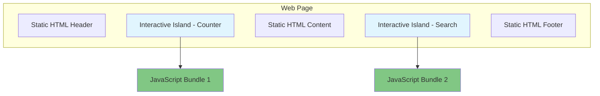
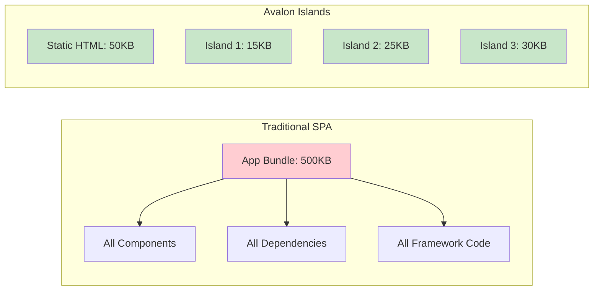

# Islands Architecture

Islands architecture is the core philosophy behind Avalon. It provides a way to build interactive web applications that are fast by default, loading JavaScript only where and when it's needed.

## What are Islands?

Islands are interactive components that "hydrate" on the client side, surrounded by static HTML. Think of them as isolated regions of interactivity in an otherwise static page.



## Static by Default

In traditional SPAs, everything is JavaScript. In Avalon, everything is static HTML unless you explicitly make it interactive.

### Traditional SPA Approach

```typescript
// Everything is JavaScript, even static content
function App() {
	return (
		<div>
			<Header /> {/* JavaScript */}
			<Navigation /> {/* JavaScript */}
			<Content /> {/* JavaScript */}
			<Counter /> {/* JavaScript - actually needs interactivity */}
			<Footer /> {/* JavaScript */}
		</div>
	);
}
```

### Avalon Islands Approach

```typescript
// Static page with selective interactivity
export default function BlogPost() {
	return (
		<div>
			<header>
				<h1>My Blog Post</h1> {/* Static HTML */}
			</header>

			<nav>
				<a href="/blog">Blog</a> {/* Static HTML */}
				<a href="/about">About</a>
			</nav>

			<article>
				<p>This is static content...</p> {/* Static HTML */}
			</article>

			{/* Only this component becomes interactive */}
			<Counter client:load />

			<footer>
				<p>&copy; 2024 My Blog</p> {/* Static HTML */}
			</footer>
		</div>
	);
}
```

## Hydration Strategies

Avalon provides several hydration strategies to control when and how islands become interactive:

### `client:load` - Immediate Hydration

Hydrates the component immediately when the page loads.

```tsx
<Counter client:load />
```

**Use when**: The component needs to be interactive immediately (form inputs, critical UI).

### `client:idle` - Idle Hydration

Hydrates when the browser becomes idle (using `requestIdleCallback`).

```tsx
<SearchWidget client:idle />
```

**Use when**: The component is important but not critical for initial page interaction.

### `client:visible` - Intersection Observer

Hydrates when the component becomes visible in the viewport.

```tsx
<ImageGallery client:visible />
```

**Use when**: The component is below the fold or in a tab/accordion.

### `client:media` - Media Query

Hydrates only when a media query matches.

```tsx
<MobileMenu client:media="(max-width: 768px)" />
```

**Use when**: The component is only needed on certain screen sizes.

### `client:only` - Client-Side Only

Skips server-side rendering entirely.

```tsx
<WebGLVisualization client:only="preact" />
```

**Use when**: The component relies on browser APIs not available during SSR.

## Performance Benefits

Islands architecture provides significant performance benefits:

### Bundle Size Comparison



### Loading Performance

| Metric                 | Traditional SPA | Avalon Islands |
| ---------------------- | --------------- | -------------- |
| First Contentful Paint | 2.1s            | 0.8s           |
| Time to Interactive    | 3.5s            | 1.2s           |
| JavaScript Bundle Size | 500KB           | 70KB (total)   |
| Hydration Time         | 800ms           | 200ms          |

## Creating Islands

### Basic Island Component

```tsx
// src/islands/Counter.tsx
import { useState } from 'preact/hooks';

export default function Counter() {
	const [count, setCount] = useState(0);

	return (
		<div className="counter">
			<button onClick={() => setCount(count - 1)}>-</button>
			<span>{count}</span>
			<button onClick={() => setCount(count + 1)}>+</button>
		</div>
	);
}
```

### Using the Island in a Page

```tsx
// src/pages/demo.tsx
import Counter from '../islands/Counter.tsx';

export default function DemoPage() {
	return (
		<div>
			<h1>Demo Page</h1>
			<p>This is static content that doesn't need JavaScript.</p>

			{/* This becomes an interactive island */}
			<Counter client:load />

			<p>More static content below the counter.</p>
		</div>
	);
}
```

## Multi-Framework Islands

One of Avalon's unique features is the ability to use different frameworks for different islands on the same page:

```tsx
// src/pages/mixed-frameworks.tsx
import PreactCounter from '../islands/PreactCounter.tsx';
import VueSearch from '../islands/VueSearch.vue';
import SvelteChart from '../islands/SvelteChart.svelte';

export default function MixedFrameworksPage() {
	return (
		<div>
			<h1>Multi-Framework Demo</h1>

			{/* Preact island */}
			<PreactCounter client:load />

			{/* Vue island */}
			<VueSearch client:idle />

			{/* Svelte island */}
			<SvelteChart client:visible />
		</div>
	);
}
```

## Nested Islands and Modular Architecture

Avalon supports organizing islands in nested directory structures, enabling modular architectures for larger applications.

### Directory Structure

Islands can be placed in any directory named `islands` within your `src/` folder:

```
src/
├── islands/                    # Default islands directory
│   ├── Counter.tsx
│   └── SearchWidget.tsx
├── modules/
│   ├── auth/
│   │   └── islands/           # Auth module islands
│   │       ├── LoginForm.tsx
│   │       └── UserProfile.tsx
│   ├── dashboard/
│   │   └── islands/           # Dashboard module islands
│   │       ├── Chart.tsx
│   │       └── DataTable.tsx
│   └── blog/
│       └── islands/           # Blog module islands
│           └── CommentSection.tsx
└── features/
    └── checkout/
        └── islands/           # Checkout feature islands
            └── PaymentForm.tsx
```

### Island Resolution Order

When you reference an island by name, Avalon resolves it using the following priority order:

1. **Explicit path-based references** - Full path to the island
2. **Qualified name matches** - Namespace/name format
3. **Default `/src/islands/` directory** - Highest priority for simple names
4. **Nested directories** - Alphabetically by namespace

```tsx
// Resolution examples:

// 1. Explicit path (always unambiguous)
import Counter from '../modules/auth/islands/Counter.tsx';

// 2. Qualified name (namespace/name)
<Island src="modules/auth/Counter" client:load />

// 3. Simple name - resolves to default /src/islands/ first
<Island src="Counter" client:load />  // Uses src/islands/Counter.tsx

// 4. If not in default, searches nested directories alphabetically
<Island src="LoginForm" client:load />  // Uses src/modules/auth/islands/LoginForm.tsx
```

### Namespace Conventions

Namespaces are derived from the directory path between `src/` and `islands/`:

| Island Location | Namespace | Qualified Name |
|-----------------|-----------|----------------|
| `src/islands/Counter.tsx` | (empty) | `Counter` |
| `src/modules/auth/islands/LoginForm.tsx` | `modules/auth` | `modules/auth/LoginForm` |
| `src/features/checkout/islands/PaymentForm.tsx` | `features/checkout` | `features/checkout/PaymentForm` |

### Handling Name Collisions

When multiple islands share the same name, use qualified names to disambiguate:

```tsx
// Two islands named "Counter" in different modules
// src/islands/Counter.tsx
// src/modules/dashboard/islands/Counter.tsx

// Using qualified names to specify which one
<Island src="Counter" client:load />                    // Default: src/islands/Counter.tsx
<Island src="modules/dashboard/Counter" client:load /> // Nested: src/modules/dashboard/islands/Counter.tsx
```

### TypeScript Support

Avalon can generate TypeScript declarations for all discovered islands:

```typescript
// Generate types during build
import { generateIslandTypes } from 'avalon';

await generateIslandTypes(projectRoot, {
  outputDir: 'src/types',
  moduleName: 'avalon-islands',
});
```

This generates type definitions that provide:
- Autocomplete for island names
- Type checking for island references
- Namespace information for disambiguation

### Configuration

You can customize island discovery with configuration options:

```typescript
// avalon.config.ts
export default {
  islands: {
    // Additional directories to scan
    include: ['src/shared/islands'],
    
    // Directories to exclude
    exclude: ['node_modules', 'dist'],
    
    // Custom namespace mapping
    namespaces: {
      'modules/auth': 'auth',
      'modules/dashboard': 'dash',
    },
    
    // Fail build on naming collisions
    strictCollisions: false,
  },
};
```

### Best Practices for Nested Islands

1. **Use meaningful namespaces**: Organize islands by feature or domain
2. **Prefer qualified names**: When referencing nested islands, use qualified names for clarity
3. **Keep default directory for shared islands**: Use `src/islands/` for commonly used components
4. **Document your structure**: Add a README to explain your island organization

## Island Communication

Islands can communicate with each other using various patterns:

### 1. URL State

Share state through URL parameters:

```tsx
// Reading from URL
const searchParams = new URLSearchParams(window.location.search);
const filter = searchParams.get('filter') || 'all';

// Updating URL
const updateFilter = (newFilter: string) => {
	const url = new URL(window.location.href);
	url.searchParams.set('filter', newFilter);
	window.history.pushState({}, '', url);
};
```

### 2. Custom Events

Use browser events for loose coupling:

```tsx
// Island A - Dispatching event
const handleSelection = (item: string) => {
	window.dispatchEvent(
		new CustomEvent('item-selected', {
			detail: { item },
		})
	);
};

// Island B - Listening for event
useEffect(() => {
	const handleItemSelected = (event: CustomEvent) => {
		setSelectedItem(event.detail.item);
	};

	window.addEventListener('item-selected', handleItemSelected);
	return () => window.removeEventListener('item-selected', handleItemSelected);
}, []);
```

### 3. Shared State Store

Use a lightweight state management solution:

```tsx
// stores/appStore.ts
import { signal } from '@preact/signals';

export const selectedItems = signal<string[]>([]);
export const currentUser = signal<User | null>(null);

// Island using the store
import { selectedItems } from '../stores/appStore.ts';

export default function ItemList() {
	return (
		<div>
			{selectedItems.value.map(item => (
				<div key={item}>{item}</div>
			))}
		</div>
	);
}
```

## Best Practices

### 1. Start Static, Add Interactivity

Begin with static HTML and only add islands where interaction is truly needed.

```tsx
// ❌ Don't make everything an island
<Header client:load />
<Navigation client:load />
<Content client:load />
<Footer client:load />

// ✅ Only interactive components are islands
<Header /> {/* Static */}
<Navigation /> {/* Static */}
<SearchForm client:idle /> {/* Interactive */}
<Content /> {/* Static */}
<Footer /> {/* Static */}
```

### 2. Choose the Right Hydration Strategy

Match the hydration strategy to the component's importance and usage:

```tsx
// Critical interaction - load immediately
<LoginForm client:load />

// Important but not critical - load when idle
<SearchWidget client:idle />

// Below the fold - load when visible
<CommentSection client:visible />

// Mobile-only - load based on screen size
<MobileMenu client:media="(max-width: 768px)" />
```

### 3. Minimize Island Dependencies

Keep island dependencies small and focused:

```tsx
// ❌ Heavy dependencies in islands
import { Chart } from 'chart.js'; // 200KB
import { moment } from 'moment'; // 300KB

// ✅ Lightweight alternatives
import { Chart } from 'chart.js/auto/auto.esm'; // Tree-shaken
import { formatDate } from '../utils/date.ts'; // Custom utility
```

### 4. Use Framework Strengths

Choose the right framework for each island's needs:

- **Preact**: Lightweight React alternative, great for most use cases
- **Vue**: Excellent for forms and complex state management
- **Svelte**: Smallest bundle size, great for animations
- **Solid**: High performance, great for data-heavy components

## Debugging Islands

### Development Tools

Avalon provides development tools to help debug islands:

```bash
# Enable island debugging
AVALON_DEBUG=islands deno task dev
```

This will log:

- Which components are being hydrated
- Hydration timing and performance
- Bundle sizes for each island
- Framework detection results

### Common Issues

**Island Not Hydrating**

```tsx
// ❌ Missing client directive
<Counter />

// ✅ Add client directive
<Counter client:load />
```

**Hydration Mismatch**

```tsx
// ❌ Different content on server vs client
export default function TimeDisplay() {
	const now = new Date(); // Different on server vs client
	return <div>{now.toISOString()}</div>;
}

// ✅ Use useEffect for client-only content
export default function TimeDisplay() {
	const [time, setTime] = useState<string>('');

	useEffect(() => {
		setTime(new Date().toISOString());
	}, []);

	return <div>{time || 'Loading...'}</div>;
}
```

## Next Steps

Now that you understand islands architecture, explore:

- [Multi-Framework Support](./multi-framework-support.md) - Using different frameworks together
- [File-System Routing](./file-system-routing.md) - How pages and islands work together
- [Server-Side Rendering](./server-side-rendering.md) - How islands are rendered on the server

## Examples

Check out these complete examples:

- [Basic Counter Island](../../examples/islands/basic-counter/)
- [Multi-Framework Demo](../../examples/islands/multi-framework/)
- [Island Communication](../../examples/islands/communication/)
- [Performance Comparison](../../examples/islands/performance/)
- [Nested Islands Organization](../../examples/islands/nested-islands/)
