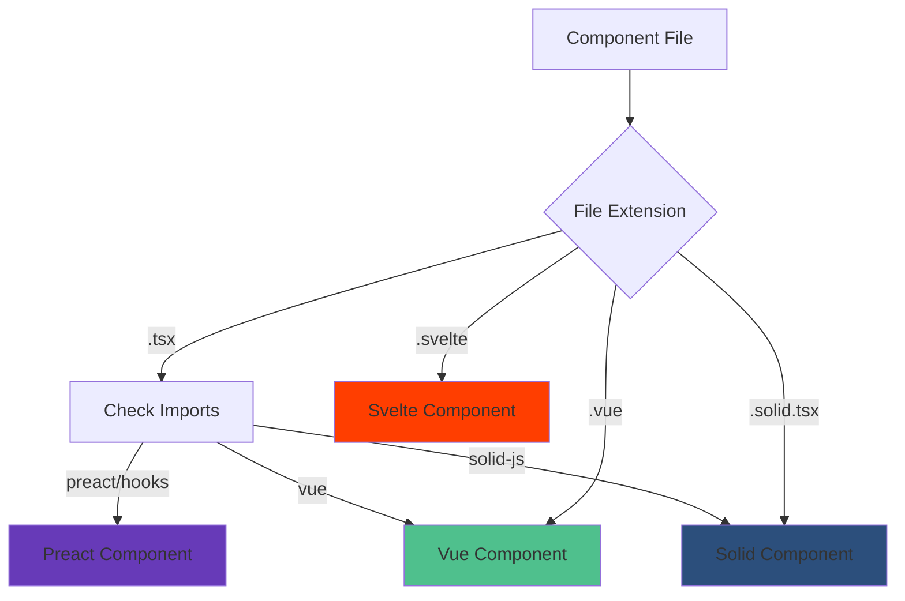
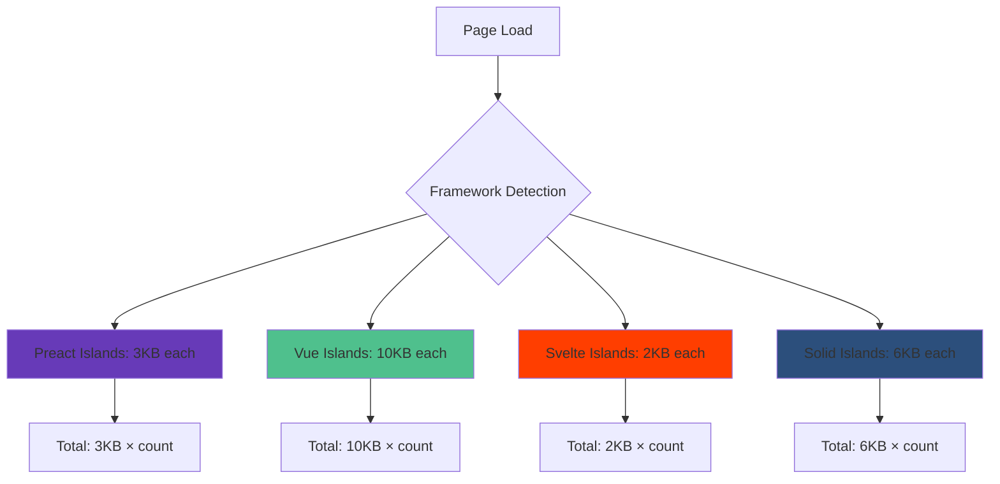

# Multi-Framework Support

Avalon's unique capability allows you to use different JavaScript frameworks within the same application. Each island can be built with the framework that best suits its needs - Preact for lightweight interactions, Vue for complex forms, Svelte for animations, or Solid for high-performance data handling.

## Supported Frameworks

Avalon supports four major frameworks out of the box:

| Framework  | Bundle Size | Best For                    | Syntax  |
| ---------- | ----------- | --------------------------- | ------- |
| **Preact** | ~3KB        | General purpose, React-like | JSX     |
| **Vue**    | ~10KB       | Forms, complex state        | SFC/JSX |
| **Svelte** | ~2KB        | Animations, minimal JS      | Svelte  |
| **Solid**  | ~6KB        | Performance, reactivity     | JSX     |

## Framework Detection

Avalon automatically detects which framework to use based on file extensions and imports:



## Framework Comparison by Example

Let's build the same counter component in each framework to see the differences:

### Preact Counter

```tsx
// src/islands/PreactCounter.tsx
import { useState } from 'preact/hooks';

interface CounterProps {
	initialValue?: number;
	step?: number;
}

export default function PreactCounter({ initialValue = 0, step = 1 }: CounterProps) {
	const [count, setCount] = useState(initialValue);

	return (
		<div className="counter">
			<h3>Preact Counter</h3>
			<div className="counter-display">
				<button onClick={() => setCount(count - step)} disabled={count <= 0}>
					-
				</button>
				<span className="count">{count}</span>
				<button onClick={() => setCount(count + step)}>+</button>
			</div>
			<p>Framework: Preact (~3KB)</p>
		</div>
	);
}
```

### Vue Counter

```vue
<!-- src/islands/VueCounter.vue -->
<template>
	<div class="counter">
		<h3>Vue Counter</h3>
		<div class="counter-display">
			<button @click="decrement" :disabled="count <= 0">-</button>
			<span class="count">{{ count }}</span>
			<button @click="increment">+</button>
		</div>
		<p>Framework: Vue (~10KB)</p>
	</div>
</template>

<script setup lang="ts">
import { ref, computed } from 'vue';

interface Props {
	initialValue?: number;
	step?: number;
}

const props = withDefaults(defineProps<Props>(), {
	initialValue: 0,
	step: 1,
});

const count = ref(props.initialValue);

const increment = () => {
	count.value += props.step;
};

const decrement = () => {
	count.value -= props.step;
};
</script>
```

### Svelte Counter

```svelte
<!-- src/islands/SvelteCounter.svelte -->
<script lang="ts">
  export let initialValue: number = 0;
  export let step: number = 1;

  let count = initialValue;

  function increment() {
    count += step;
  }

  function decrement() {
    count -= step;
  }
</script>

<div class="counter">
  <h3>Svelte Counter</h3>
  <div class="counter-display">
    <button
      on:click={decrement}
      disabled={count <= 0}
    >
      -
    </button>
    <span class="count">{count}</span>
    <button on:click={increment}>+</button>
  </div>
  <p>Framework: Svelte (~2KB)</p>
</div>

<style>
  .counter {
    border: 2px solid #ff3e00;
    border-radius: 8px;
    padding: 1rem;
  }

  .counter-display {
    display: flex;
    align-items: center;
    gap: 1rem;
    margin: 1rem 0;
  }

  .count {
    font-size: 1.5rem;
    font-weight: bold;
    min-width: 3rem;
    text-align: center;
  }
</style>
```

### Solid Counter

```tsx
// src/islands/SolidCounter.solid.tsx
import { createSignal } from 'solid-js';

interface CounterProps {
	initialValue?: number;
	step?: number;
}

export default function SolidCounter(props: CounterProps) {
	const [count, setCount] = createSignal(props.initialValue || 0);
	const step = () => props.step || 1;

	return (
		<div class="counter">
			<h3>Solid Counter</h3>
			<div class="counter-display">
				<button onClick={() => setCount(count() - step())} disabled={count() <= 0}>
					-
				</button>
				<span class="count">{count()}</span>
				<button onClick={() => setCount(count() + step())}>+</button>
			</div>
			<p>Framework: Solid (~6KB)</p>
		</div>
	);
}
```

## Using Multiple Frameworks in One Page

Here's how you can combine all frameworks in a single page:

```tsx
// src/pages/framework-comparison.tsx
import PreactCounter from '../islands/PreactCounter.tsx';
import VueCounter from '../islands/VueCounter.vue';
import SvelteCounter from '../islands/SvelteCounter.svelte';
import SolidCounter from '../islands/SolidCounter.solid.tsx';

export default function FrameworkComparison() {
	return (
		<div>
			<h1>Multi-Framework Demo</h1>
			<p>
				This page demonstrates Avalon's ability to use multiple frameworks in the same application. Each counter is
				built with a different framework.
			</p>

			<div className="framework-grid">
				<PreactCounter client:load initialValue={5} step={2} />
				<VueCounter client:idle initialValue={10} step={3} />
				<SvelteCounter client:visible initialValue={0} step={1} />
				<SolidCounter client:load initialValue={20} step={5} />
			</div>

			<div className="comparison-table">
				<h2>Framework Comparison</h2>
				<table>
					<thead>
						<tr>
							<th>Framework</th>
							<th>Bundle Size</th>
							<th>Syntax</th>
							<th>Best For</th>
						</tr>
					</thead>
					<tbody>
						<tr>
							<td>Preact</td>
							<td>~3KB</td>
							<td>JSX</td>
							<td>React-like development</td>
						</tr>
						<tr>
							<td>Vue</td>
							<td>~10KB</td>
							<td>SFC/JSX</td>
							<td>Complex forms, state management</td>
						</tr>
						<tr>
							<td>Svelte</td>
							<td>~2KB</td>
							<td>Svelte</td>
							<td>Animations, minimal JS</td>
						</tr>
						<tr>
							<td>Solid</td>
							<td>~6KB</td>
							<td>JSX</td>
							<td>High performance, fine-grained reactivity</td>
						</tr>
					</tbody>
				</table>
			</div>
		</div>
	);
}
```

## Framework-Specific Features

### Preact - React Ecosystem Compatibility

Preact provides excellent React compatibility, allowing you to use most React libraries:

```tsx
// src/islands/PreactWithLibraries.tsx
import { useState, useEffect } from 'preact/hooks';
import { format } from 'date-fns'; // React ecosystem library

export default function PreactWithLibraries() {
	const [date, setDate] = useState(new Date());

	useEffect(() => {
		const timer = setInterval(() => setDate(new Date()), 1000);
		return () => clearInterval(timer);
	}, []);

	return (
		<div>
			<h3>Current Time</h3>
			<p>{format(date, 'PPpp')}</p>
		</div>
	);
}
```

### Vue - Composition API and Reactivity

Vue's composition API provides powerful reactivity and composables:

```vue
<!-- src/islands/VueForm.vue -->
<template>
	<form @submit.prevent="handleSubmit">
		<h3>Contact Form</h3>

		<div class="field">
			<label for="name">Name:</label>
			<input id="name" v-model="form.name" :class="{ error: errors.name }" @blur="validateName" />
			<span v-if="errors.name" class="error">{{ errors.name }}</span>
		</div>

		<div class="field">
			<label for="email">Email:</label>
			<input id="email" v-model="form.email" type="email" :class="{ error: errors.email }" @blur="validateEmail" />
			<span v-if="errors.email" class="error">{{ errors.email }}</span>
		</div>

		<button type="submit" :disabled="!isValid">Submit</button>
	</form>
</template>

<script setup lang="ts">
import { reactive, computed } from 'vue';

const form = reactive({
	name: '',
	email: '',
});

const errors = reactive({
	name: '',
	email: '',
});

const isValid = computed(() => form.name && form.email && !errors.name && !errors.email);

const validateName = () => {
	errors.name = form.name.length < 2 ? 'Name must be at least 2 characters' : '';
};

const validateEmail = () => {
	const emailRegex = /^[^\s@]+@[^\s@]+\.[^\s@]+$/;
	errors.email = !emailRegex.test(form.email) ? 'Invalid email format' : '';
};

const handleSubmit = () => {
	validateName();
	validateEmail();

	if (isValid.value) {
		console.log('Form submitted:', form);
	}
};
</script>
```

### Svelte - Built-in Animations and Stores

Svelte excels at animations and has built-in state management:

```svelte
<!-- src/islands/SvelteAnimation.svelte -->
<script lang="ts">
  import { fade, slide } from 'svelte/transition';
  import { writable } from 'svelte/store';

  let items = ['Apple', 'Banana', 'Cherry'];
  let newItem = '';
  let showForm = false;

  // Svelte store for global state
  const globalCount = writable(0);

  function addItem() {
    if (newItem.trim()) {
      items = [...items, newItem.trim()];
      newItem = '';
      showForm = false;
    }
  }

  function removeItem(index: number) {
    items = items.filter((_, i) => i !== index);
  }
</script>

<div class="animated-list">
  <h3>Animated Todo List</h3>

  <button on:click={() => showForm = !showForm}>
    {showForm ? 'Cancel' : 'Add Item'}
  </button>

  {#if showForm}
    <form on:submit|preventDefault={addItem} transition:slide>
      <input bind:value={newItem} placeholder="Enter new item" />
      <button type="submit">Add</button>
    </form>
  {/if}

  <ul>
    {#each items as item, index (item)}
      <li transition:fade>
        <span>{item}</span>
        <button on:click={() => removeItem(index)}>×</button>
      </li>
    {/each}
  </ul>

  <p>Global count: {$globalCount}</p>
  <button on:click={() => globalCount.update(n => n + 1)}>
    Increment Global
  </button>
</div>

<style>
  .animated-list {
    max-width: 300px;
  }

  form {
    display: flex;
    gap: 0.5rem;
    margin: 1rem 0;
  }

  ul {
    list-style: none;
    padding: 0;
  }

  li {
    display: flex;
    justify-content: space-between;
    align-items: center;
    padding: 0.5rem;
    margin: 0.25rem 0;
    background: #f5f5f5;
    border-radius: 4px;
  }

  button {
    background: #ff3e00;
    color: white;
    border: none;
    padding: 0.25rem 0.5rem;
    border-radius: 4px;
    cursor: pointer;
  }
</style>
```

### Solid - Fine-Grained Reactivity

Solid provides the most efficient reactivity system:

```tsx
// src/islands/SolidDataTable.solid.tsx
import { createSignal, createMemo, For } from 'solid-js';

interface User {
	id: number;
	name: string;
	email: string;
	role: string;
}

export default function SolidDataTable() {
	const [users, setUsers] = createSignal<User[]>([
		{ id: 1, name: 'John Doe', email: 'john@example.com', role: 'Admin' },
		{ id: 2, name: 'Jane Smith', email: 'jane@example.com', role: 'User' },
		{ id: 3, name: 'Bob Johnson', email: 'bob@example.com', role: 'User' },
	]);

	const [filter, setFilter] = createSignal('');
	const [sortBy, setSortBy] = createSignal<keyof User>('name');

	// Memoized computed values - only recalculate when dependencies change
	const filteredUsers = createMemo(() => {
		const filterText = filter().toLowerCase();
		return users().filter(
			user =>
				user.name.toLowerCase().includes(filterText) ||
				user.email.toLowerCase().includes(filterText) ||
				user.role.toLowerCase().includes(filterText)
		);
	});

	const sortedUsers = createMemo(() => {
		const sorted = [...filteredUsers()];
		const key = sortBy();
		return sorted.sort((a, b) => a[key].localeCompare(b[key]));
	});

	return (
		<div class="data-table">
			<h3>User Management (Solid)</h3>

			<div class="controls">
				<input
					type="text"
					placeholder="Filter users..."
					value={filter()}
					onInput={e => setFilter(e.currentTarget.value)}
				/>

				<select value={sortBy()} onChange={e => setSortBy(e.currentTarget.value as keyof User)}>
					<option value="name">Sort by Name</option>
					<option value="email">Sort by Email</option>
					<option value="role">Sort by Role</option>
				</select>
			</div>

			<table>
				<thead>
					<tr>
						<th>Name</th>
						<th>Email</th>
						<th>Role</th>
					</tr>
				</thead>
				<tbody>
					<For each={sortedUsers()}>
						{user => (
							<tr>
								<td>{user.name}</td>
								<td>{user.email}</td>
								<td>{user.role}</td>
							</tr>
						)}
					</For>
				</tbody>
			</table>

			<p>
				Showing {sortedUsers().length} of {users().length} users
			</p>
		</div>
	);
}
```

## Framework Selection Guide

### When to Use Preact

**Best for:**

- React developers wanting familiar syntax
- Components that need React ecosystem libraries
- General-purpose interactive components
- Teams with React experience

**Example use cases:**

- Form components with validation libraries
- Data visualization with React charting libraries
- UI components that need React-based design systems

### When to Use Vue

**Best for:**

- Complex forms with validation
- Components with heavy state management
- Teams familiar with Vue ecosystem
- Applications needing two-way data binding

**Example use cases:**

- Multi-step forms
- Admin dashboards
- Real-time data displays
- Components with complex computed properties

### When to Use Svelte

**Best for:**

- Animations and transitions
- Minimal JavaScript footprint
- Components with built-in styling
- Simple, self-contained widgets

**Example use cases:**

- Interactive animations
- Small widgets and embeds
- Components where bundle size is critical
- UI elements with custom styling

### When to Use Solid

**Best for:**

- High-performance data handling
- Components with frequent updates
- Fine-grained reactivity needs
- Performance-critical applications

**Example use cases:**

- Real-time data tables
- Live charts and graphs
- High-frequency update components
- Performance-sensitive applications

## Framework Communication

Islands built with different frameworks can communicate using several patterns:

### 1. Custom Events (Framework Agnostic)

```tsx
// Preact island dispatching event
const handleClick = () => {
	window.dispatchEvent(
		new CustomEvent('user-selected', {
			detail: { userId: 123 },
		})
	);
};

// Vue island listening for event
onMounted(() => {
	window.addEventListener('user-selected', event => {
		selectedUser.value = event.detail.userId;
	});
});

// Svelte island listening for event
onMount(() => {
	const handleUserSelected = event => {
		selectedUser = event.detail.userId;
	};

	window.addEventListener('user-selected', handleUserSelected);

	return () => {
		window.removeEventListener('user-selected', handleUserSelected);
	};
});
```

### 2. Shared State Store

```typescript
// stores/globalStore.ts
class GlobalStore {
	private listeners = new Set<() => void>();
	private state = { selectedUser: null, theme: 'light' };

	subscribe(callback: () => void) {
		this.listeners.add(callback);
		return () => this.listeners.delete(callback);
	}

	getState() {
		return this.state;
	}

	setState(updates: Partial<typeof this.state>) {
		this.state = { ...this.state, ...updates };
		this.listeners.forEach(callback => callback());
	}
}

export const globalStore = new GlobalStore();
```

## Performance Considerations

### Bundle Size Impact



### Framework Loading Strategy

Avalon optimizes framework loading by:

1. **Code Splitting**: Each framework is loaded only when needed
2. **Shared Dependencies**: Common dependencies are deduplicated
3. **Tree Shaking**: Unused framework features are removed
4. **Lazy Loading**: Frameworks load based on hydration strategy

## Best Practices

### 1. Choose the Right Framework for the Job

```tsx
// ❌ Using heavy framework for simple task
<VueComplexForm client:load>
  <button>Click me</button>
</VueComplexForm>

// ✅ Use lightweight framework for simple interactions
<PreactButton client:load>
  <button>Click me</button>
</PreactButton>
```

### 2. Minimize Framework Mixing

```tsx
// ❌ Too many different frameworks
<PreactCounter client:load />
<VueCounter client:load />
<SvelteCounter client:load />
<SolidCounter client:load />

// ✅ Use one framework per logical section
<PreactSection client:load>
  <PreactCounter />
  <PreactForm />
  <PreactChart />
</PreactSection>
```

### 3. Consider Team Expertise

Choose frameworks your team is comfortable with:

```tsx
// If team knows React well
<PreactComponents client:load />

// If team prefers Vue
<VueComponents client:load />

// If performance is critical
<SolidComponents client:load />
```

## Migration Between Frameworks

You can gradually migrate islands from one framework to another:

### Phase 1: Add New Framework

```tsx
// Keep existing Preact islands
<PreactCounter client:load />

// Add new Vue islands
<VueForm client:idle />
```

### Phase 2: Migrate Gradually

```tsx
// Replace one island at a time
<VueCounter client:load /> {/* Migrated from Preact */}
<VueForm client:idle />
```

### Phase 3: Remove Old Framework

```tsx
// All islands now use Vue
<VueCounter client:load />
<VueForm client:idle />
```

## Next Steps

- [Islands Architecture](./islands-architecture.md) - Understanding the foundation
- [File-System Routing](./file-system-routing.md) - How routing works with multi-framework islands
- [Build System](./build-system.md) - How Avalon bundles different frameworks

## Examples

- [Multi-Framework Demo](../../examples/multi-framework/)
- [Framework Performance Comparison](../../examples/performance-comparison/)
- [Framework Migration Guide](../../examples/migration/)
