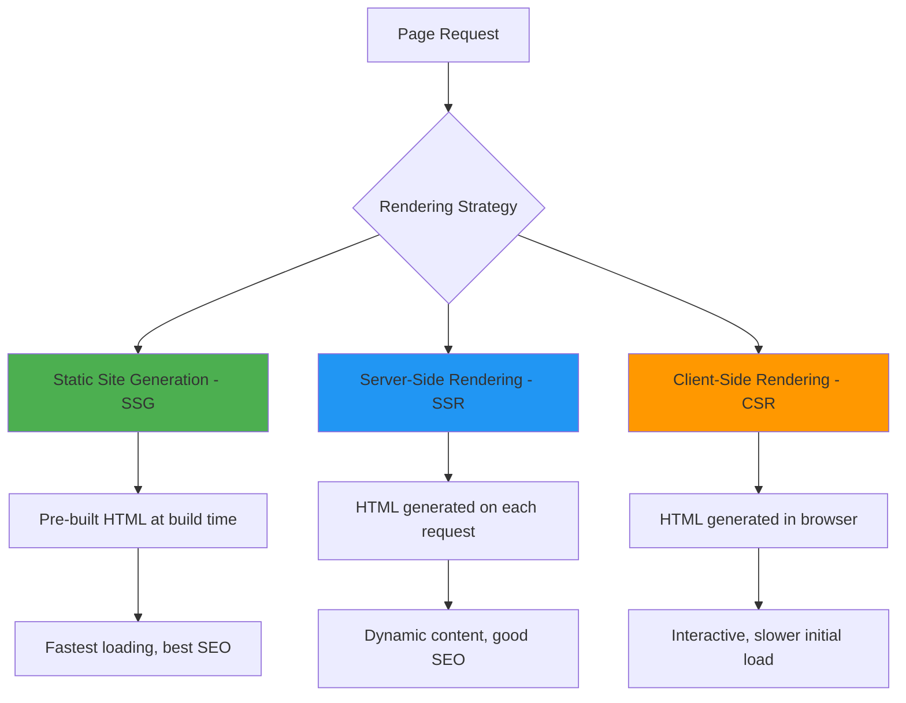
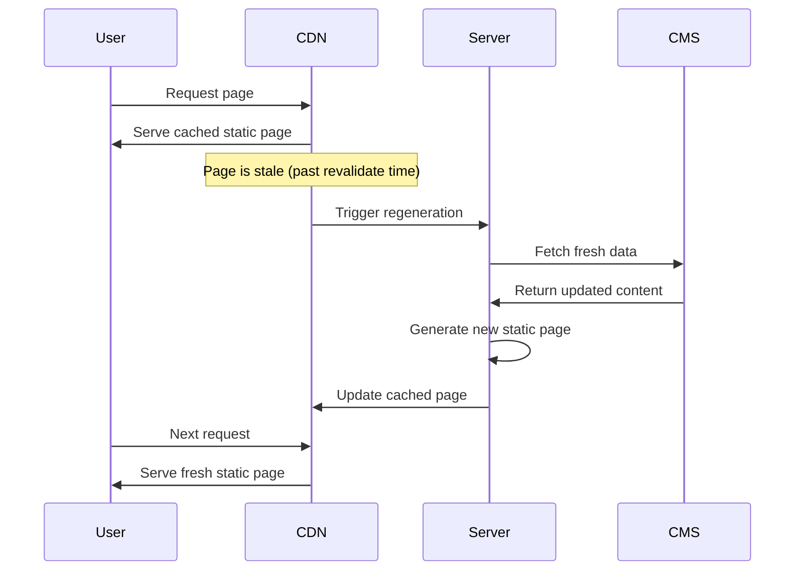
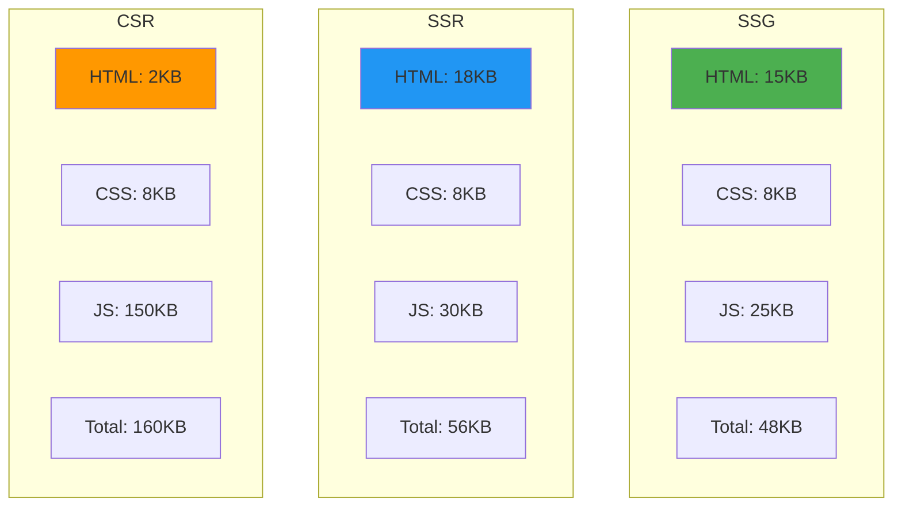

# Server-Side Rendering (SSR) and Static Site Generation (SSG)

Avalon provides flexible rendering strategies that optimize for performance, SEO, and user experience. Understanding when and how to use SSR, SSG, and client-side rendering is crucial for building fast, scalable applications.

## Rendering Strategies Overview



## Static Site Generation (SSG)

SSG pre-renders pages at build time, creating static HTML files that can be served instantly from a CDN.

### When to Use SSG

**Perfect for:**

- Marketing pages
- Blog posts
- Documentation
- Product catalogs
- Landing pages

**Benefits:**

- Fastest possible loading times
- Excellent SEO
- High security (no server-side code execution)
- Easy to cache and distribute via CDN
- Lower hosting costs

### Basic SSG Example

```tsx
// src/pages/about.tsx
export default function About() {
	return (
		<div>
			<h1>About Our Company</h1>
			<p>We've been building amazing software since 2020.</p>
			<p>Our team is passionate about creating great user experiences.</p>
		</div>
	);
}

// This page is automatically statically generated
// HTML is created at build time and served instantly
```

### SSG with Data Fetching

```tsx
// src/pages/blog/index.tsx
interface BlogPost {
	id: string;
	title: string;
	excerpt: string;
	publishedAt: string;
	slug: string;
}

interface BlogIndexProps {
	posts: BlogPost[];
}

// This function runs at build time
export async function getStaticProps() {
	const posts = await fetchBlogPosts();

	return {
		props: {
			posts,
		},
		// Regenerate the page at most once per hour
		revalidate: 3600,
	};
}

export default function BlogIndex({ posts }: BlogIndexProps) {
	return (
		<div>
			<h1>Our Blog</h1>
			<div className="posts-grid">
				{posts.map(post => (
					<article key={post.id} className="post-card">
						<h2>
							<a href={`/blog/${post.slug}`}>{post.title}</a>
						</h2>
						<p>{post.excerpt}</p>
						<time>{new Date(post.publishedAt).toLocaleDateString()}</time>
					</article>
				))}
			</div>
		</div>
	);
}
```

### Dynamic SSG with Parameters

```tsx
// src/pages/blog/[slug].tsx
interface BlogPost {
	title: string;
	content: string;
	publishedAt: string;
	author: string;
}

interface BlogPostProps {
	post: BlogPost;
}

// Generate static paths at build time
export async function getStaticPaths() {
	const posts = await fetchAllBlogPosts();

	const paths = posts.map(post => ({
		params: { slug: post.slug },
	}));

	return {
		paths,
		// Enable ISR for new posts
		fallback: 'blocking',
	};
}

// Generate static props for each path
export async function getStaticProps({ params }: { params: { slug: string } }) {
	const post = await fetchBlogPost(params.slug);

	if (!post) {
		return {
			notFound: true,
		};
	}

	return {
		props: {
			post,
		},
		// Regenerate if content changes
		revalidate: 86400, // 24 hours
	};
}

export default function BlogPost({ post }: BlogPostProps) {
	return (
		<article>
			<header>
				<h1>{post.title}</h1>
				<p>
					By {post.author} on {new Date(post.publishedAt).toLocaleDateString()}
				</p>
			</header>

			<div className="content" dangerouslySetInnerHTML={{ __html: post.content }} />
		</article>
	);
}
```

## Server-Side Rendering (SSR)

SSR generates HTML on the server for each request, allowing for dynamic content while maintaining SEO benefits.

### When to Use SSR

**Perfect for:**

- User dashboards
- Personalized content
- Real-time data displays
- Authentication-dependent pages
- E-commerce product pages

**Benefits:**

- Dynamic content on each request
- Good SEO (HTML is available immediately)
- Personalized content
- Real-time data
- Better security for sensitive data

### Basic SSR Example

```tsx
// src/pages/dashboard.tsx
interface User {
	name: string;
	email: string;
	lastLogin: string;
}

interface DashboardProps {
	user: User;
	notifications: Notification[];
}

// This function runs on each request
export async function getServerSideProps({ req }: { req: Request }) {
	const token = req.headers.authorization;

	if (!token) {
		return {
			redirect: {
				destination: '/login',
				permanent: false,
			},
		};
	}

	try {
		const user = await authenticateUser(token);
		const notifications = await fetchUserNotifications(user.id);

		return {
			props: {
				user,
				notifications,
			},
		};
	} catch (error) {
		return {
			redirect: {
				destination: '/login',
				permanent: false,
			},
		};
	}
}

export default function Dashboard({ user, notifications }: DashboardProps) {
	return (
		<div>
			<header>
				<h1>Welcome back, {user.name}!</h1>
				<p>Last login: {new Date(user.lastLogin).toLocaleString()}</p>
			</header>

			<section>
				<h2>Notifications ({notifications.length})</h2>
				{notifications.map(notification => (
					<div key={notification.id} className="notification">
						<h3>{notification.title}</h3>
						<p>{notification.message}</p>
						<time>{new Date(notification.createdAt).toLocaleString()}</time>
					</div>
				))}
			</section>
		</div>
	);
}
```

### SSR with Real-Time Data

```tsx
// src/pages/analytics.tsx
interface AnalyticsData {
	pageViews: number;
	uniqueVisitors: number;
	bounceRate: number;
	topPages: Array<{ path: string; views: number }>;
	realtimeUsers: number;
}

interface AnalyticsProps {
	data: AnalyticsData;
	lastUpdated: string;
}

export async function getServerSideProps() {
	// Fetch real-time analytics data
	const data = await fetchAnalyticsData();

	return {
		props: {
			data,
			lastUpdated: new Date().toISOString(),
		},
	};
}

export default function Analytics({ data, lastUpdated }: AnalyticsProps) {
	return (
		<div>
			<header>
				<h1>Analytics Dashboard</h1>
				<p>Last updated: {new Date(lastUpdated).toLocaleString()}</p>
				<p>Real-time users: {data.realtimeUsers}</p>
			</header>

			<div className="metrics-grid">
				<div className="metric">
					<h3>Page Views</h3>
					<p className="metric-value">{data.pageViews.toLocaleString()}</p>
				</div>

				<div className="metric">
					<h3>Unique Visitors</h3>
					<p className="metric-value">{data.uniqueVisitors.toLocaleString()}</p>
				</div>

				<div className="metric">
					<h3>Bounce Rate</h3>
					<p className="metric-value">{(data.bounceRate * 100).toFixed(1)}%</p>
				</div>
			</div>

			<section>
				<h2>Top Pages</h2>
				<ul>
					{data.topPages.map(page => (
						<li key={page.path}>
							<span>{page.path}</span>
							<span>{page.views} views</span>
						</li>
					))}
				</ul>
			</section>
		</div>
	);
}
```

## Incremental Static Regeneration (ISR)

ISR combines the benefits of SSG and SSR by allowing static pages to be updated after build time.

### How ISR Works



### ISR Configuration

```tsx
// src/pages/products/[id].tsx
interface Product {
	id: string;
	name: string;
	price: number;
	description: string;
	inStock: boolean;
	lastUpdated: string;
}

export async function getStaticPaths() {
	// Pre-generate popular products
	const popularProducts = await fetchPopularProducts();

	const paths = popularProducts.map(product => ({
		params: { id: product.id },
	}));

	return {
		paths,
		// Generate other products on-demand
		fallback: 'blocking',
	};
}

export async function getStaticProps({ params }: { params: { id: string } }) {
	const product = await fetchProduct(params.id);

	if (!product) {
		return { notFound: true };
	}

	return {
		props: { product },
		// Revalidate every 5 minutes
		revalidate: 300,
	};
}

export default function ProductPage({ product }: { product: Product }) {
	return (
		<div>
			<h1>{product.name}</h1>
			<p className="price">${product.price}</p>
			<p className={`stock ${product.inStock ? 'in-stock' : 'out-of-stock'}`}>
				{product.inStock ? 'In Stock' : 'Out of Stock'}
			</p>
			<p>{product.description}</p>
			<p className="last-updated">Last updated: {new Date(product.lastUpdated).toLocaleString()}</p>
		</div>
	);
}
```

## Performance Comparison

### Loading Performance Metrics

| Strategy | First Contentful Paint | Time to Interactive | SEO Score | Dynamic Content |
| -------- | ---------------------- | ------------------- | --------- | --------------- |
| **SSG**  | 0.5s                   | 1.2s                | 100%      | ❌              |
| **ISR**  | 0.6s                   | 1.3s                | 100%      | ✅ (with delay) |
| **SSR**  | 1.2s                   | 2.1s                | 95%       | ✅              |
| **CSR**  | 2.8s                   | 3.5s                | 60%       | ✅              |

### Bundle Size Impact



### Server Resource Usage

| Strategy | CPU Usage | Memory Usage | Database Queries | Cache Hit Rate |
| -------- | --------- | ------------ | ---------------- | -------------- |
| **SSG**  | Minimal   | Low          | None (runtime)   | 100%           |
| **ISR**  | Low       | Medium       | Occasional       | 95%            |
| **SSR**  | High      | High         | Every request    | 70%            |
| **CSR**  | Minimal   | Low          | Via API          | 80%            |

## Hybrid Rendering Strategies

Avalon allows mixing rendering strategies within the same application:

```tsx
// avalon.config.ts
export default {
	pages: {
		// Static pages
		'/': 'ssg',
		'/about': 'ssg',
		'/contact': 'ssg',

		// Blog with ISR
		'/blog/*': {
			strategy: 'isr',
			revalidate: 3600,
		},

		// Dynamic user pages
		'/dashboard/*': 'ssr',
		'/profile/*': 'ssr',

		// API routes are always SSR
		'/api/*': 'ssr',
	},
};
```

### Page-Level Strategy Selection

```tsx
// src/pages/mixed-content.tsx

// Static content - rendered at build time
export async function getStaticProps() {
	const staticContent = await fetchStaticContent();

	return {
		props: { staticContent },
		revalidate: 86400, // 24 hours
	};
}

export default function MixedContent({ staticContent }) {
	return (
		<div>
			{/* Static content from SSG */}
			<section>
				<h1>{staticContent.title}</h1>
				<p>{staticContent.description}</p>
			</section>

			{/* Dynamic content via islands */}
			<UserDashboard client:load />
			<RealtimeChat client:idle />
			<PersonalizedRecommendations client:visible />
		</div>
	);
}
```

## Caching Strategies

### CDN Caching


### Cache Headers Configuration

```tsx
// src/pages/api/products/[id].ts
export async function GET(req: Request, res: Response) {
	const { id } = req.params;
	const product = await fetchProduct(id);

	if (!product) {
		return res.status(404).json({ error: 'Product not found' });
	}

	// Cache for 5 minutes, stale-while-revalidate for 1 hour
	res.setHeader('Cache-Control', 'public, max-age=300, stale-while-revalidate=3600');

	return res.json(product);
}

// src/pages/blog/[slug].tsx
export async function getStaticProps({ params }) {
	const post = await fetchBlogPost(params.slug);

	return {
		props: { post },
		revalidate: 3600, // ISR revalidation
		headers: {
			// CDN caching
			'Cache-Control': 'public, max-age=31536000, immutable',
		},
	};
}
```

## SEO Optimization

### Meta Tags and Structured Data

```tsx
// src/pages/products/[id].tsx
import { generateMetadata } from '../../utils/seo.ts';

export async function getStaticProps({ params }) {
	const product = await fetchProduct(params.id);

	return {
		props: {
			product,
			metadata: generateMetadata({
				title: product.name,
				description: product.description,
				image: product.image,
				type: 'product',
				price: product.price,
				availability: product.inStock ? 'in_stock' : 'out_of_stock',
			}),
		},
	};
}

export default function ProductPage({ product, metadata }) {
	return (
		<>
			<head>
				<title>{metadata.title}</title>
				<meta name="description" content={metadata.description} />
				<meta property="og:title" content={metadata.title} />
				<meta property="og:description" content={metadata.description} />
				<meta property="og:image" content={metadata.image} />
				<meta property="og:type" content="product" />

				{/* Structured data for rich snippets */}
				<script type="application/ld+json">
					{JSON.stringify({
						'@context': 'https://schema.org',
						'@type': 'Product',
						name: product.name,
						description: product.description,
						image: product.image,
						offers: {
							'@type': 'Offer',
							price: product.price,
							priceCurrency: 'USD',
							availability: product.inStock ? 'https://schema.org/InStock' : 'https://schema.org/OutOfStock',
						},
					})}
				</script>
			</head>

			<div>
				<h1>{product.name}</h1>
				
				<p>{product.description}</p>
				<p className="price">${product.price}</p>
			</div>
		</>
	);
}
```

## Error Handling and Fallbacks

### ISR Fallback Strategies

```tsx
// src/pages/blog/[slug].tsx
export async function getStaticPaths() {
	const posts = await fetchPopularPosts();

	return {
		paths: posts.map(post => ({ params: { slug: post.slug } })),
		// Different fallback strategies
		fallback: 'blocking', // Generate on first request
		// fallback: true      // Show loading state, then generate
		// fallback: false     // 404 for non-pre-generated paths
	};
}

export async function getStaticProps({ params }) {
	try {
		const post = await fetchBlogPost(params.slug);

		if (!post) {
			return { notFound: true };
		}

		return {
			props: { post },
			revalidate: 3600,
		};
	} catch (error) {
		console.error('Error fetching blog post:', error);

		// Return error page or fallback content
		return {
			props: {
				error: 'Failed to load blog post',
			},
			revalidate: 60, // Retry more frequently on error
		};
	}
}
```

### Graceful Degradation

```tsx
// src/pages/dashboard.tsx
export async function getServerSideProps({ req }) {
	try {
		const user = await authenticateUser(req);
		const data = await fetchDashboardData(user.id);

		return {
			props: { user, data, error: null },
		};
	} catch (error) {
		// Graceful degradation - still render page with error state
		return {
			props: {
				user: null,
				data: null,
				error: error.message,
			},
		};
	}
}

export default function Dashboard({ user, data, error }) {
	if (error) {
		return (
			<div className="error-state">
				<h1>Dashboard Temporarily Unavailable</h1>
				<p>We're experiencing technical difficulties. Please try again later.</p>
				<button onClick={() => window.location.reload()}>Retry</button>
			</div>
		);
	}

	if (!user) {
		return <LoginPrompt />;
	}

	return (
		<div>
			<h1>Welcome, {user.name}</h1>
			{/* Dashboard content */}
		</div>
	);
}
```

## Best Practices

### 1. Choose the Right Strategy

```tsx
// ✅ Good - appropriate strategy selection
const pages = {
	// Static content - use SSG
	'/': 'ssg',
	'/about': 'ssg',
	'/pricing': 'ssg',

	// Content that changes occasionally - use ISR
	'/blog/*': { strategy: 'isr', revalidate: 3600 },
	'/products/*': { strategy: 'isr', revalidate: 300 },

	// User-specific content - use SSR
	'/dashboard': 'ssr',
	'/profile': 'ssr',
	'/orders': 'ssr',
};

// ❌ Avoid - using SSR for static content
const pages = {
	'/': 'ssr', // Should be SSG
	'/about': 'ssr', // Should be SSG
	'/pricing': 'ssr', // Should be SSG
};
```

### 2. Optimize Data Fetching

```tsx
// ✅ Good - parallel data fetching
export async function getStaticProps() {
	const [posts, categories, featured] = await Promise.all([fetchBlogPosts(), fetchCategories(), fetchFeaturedPost()]);

	return {
		props: { posts, categories, featured },
		revalidate: 3600,
	};
}

// ❌ Avoid - sequential data fetching
export async function getStaticProps() {
	const posts = await fetchBlogPosts();
	const categories = await fetchCategories();
	const featured = await fetchFeaturedPost();

	return {
		props: { posts, categories, featured },
		revalidate: 3600,
	};
}
```

### 3. Implement Proper Error Handling

```tsx
// ✅ Good - comprehensive error handling
export async function getServerSideProps({ params }) {
	try {
		const data = await fetchData(params.id);

		return {
			props: { data, error: null },
		};
	} catch (error) {
		if (error.status === 404) {
			return { notFound: true };
		}

		if (error.status === 403) {
			return {
				redirect: {
					destination: '/unauthorized',
					permanent: false,
				},
			};
		}

		// Log error for monitoring
		console.error('SSR Error:', error);

		return {
			props: {
				data: null,
				error: 'Failed to load data',
			},
		};
	}
}
```

## Monitoring and Analytics

### Performance Monitoring

```tsx
// src/utils/performance.ts
export function measureRenderTime(strategy: string, page: string) {
	const startTime = performance.now();

	return {
		end: () => {
			const endTime = performance.now();
			const duration = endTime - startTime;

			// Send to analytics
			analytics.track('page_render', {
				strategy,
				page,
				duration,
				timestamp: new Date().toISOString(),
			});
		},
	};
}

// Usage in pages
export async function getStaticProps() {
	const timer = measureRenderTime('ssg', '/blog');

	const data = await fetchData();

	timer.end();

	return {
		props: { data },
	};
}
```

## Next Steps

- [Islands Architecture](./islands-architecture.md) - Adding interactivity to rendered pages
- [Build System](./build-system.md) - How rendering strategies are optimized
- [Multi-Framework Support](./multi-framework-support.md) - Using different frameworks with SSR/SSG

## Examples

- [SSG Blog](../../examples/rendering/ssg-blog/)
- [SSR Dashboard](../../examples/rendering/ssr-dashboard/)
- [ISR E-commerce](../../examples/rendering/isr-ecommerce/)
- [Hybrid Application](../../examples/rendering/hybrid-app/)
